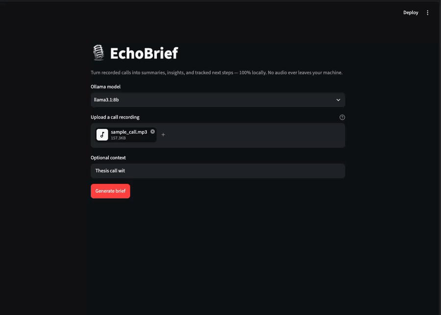

# EchoBrief 🎙️→✅

**Turn recorded calls — supervision meetings, coaching sessions, client check-ins, 1:1s — into summaries, insights, and tracked next steps, 100% locally.** No cloud APIs, no per-token billing, no audio ever leaving your machine. Built on faster-whisper + Ollama + Streamlit.


---

<!-- 📸 DEMO GOES HERE — this is the single most important element on the page.
     Record a 15–30s GIF: upload file → progress states → rendered brief → download.
     Tools: LICEcap, Kap, or `ffmpeg` screen capture. Keep it under 10 MB. -->


## What it does

Feedback and action items from important calls die inside un-reviewed audio recordings — the student who never re-listens to a supervision meeting, the coach with a week of session recordings, the freelancer with client check-ins. EchoBrief takes an uploaded call recording (`.mp3`, `.wav`, `.m4a`, `.opus`, `.ogg` — WhatsApp voice notes work out of the box) and produces:

1. **A full transcript** (local Whisper inference — expandable panel)
2. **A 3–5 sentence summary** of the call
3. **Key insights & feedback received**
4. **Numbered action items** with priority and suggested deadlines — each backed by a quoted snippet from the transcript so you can verify nothing was hallucinated

Export the whole brief as Markdown and drop it into your notes.

**Why local?** These calls carry unreleased research, grades, client confidences, and personal feedback. This pipeline makes zero network calls beyond `localhost` — the privacy guarantee is architectural, not a policy promise.

---

## Quickstart

### Path A — uv + Ollama (recommended)

Prereqs: [uv](https://docs.astral.sh/uv/getting-started/installation/), [ffmpeg](https://ffmpeg.org/download.html), [Ollama](https://ollama.com/download). No Python install needed — uv fetches the right version automatically.

```bash
git clone https://github.com/Kennexcorp/echobrief && cd echobrief
uv sync
ollama pull llama3.1:8b
uv run streamlit run app/main.py
```

First transcription downloads the Whisper `small` model (~500 MB) from the Hugging Face Hub automatically.

### Path B — Docker (one command, fully reproducible)

Prereqs: Docker + Compose.

```bash
git clone https://github.com/Kennexcorp/echobrief && cd echobrief
docker compose up
# first run only — pull the LLM into the ollama service:
docker compose exec ollama ollama pull llama3.1:8b
```

This stands up both the app and an Ollama service on a shared network, with model weights persisted in named volumes (nothing multi-GB is baked into the image). Using Ollama on your host instead? Set `OLLAMA_BASE_URL=http://host.docker.internal:11434` in `.env`.

Prefer not to build? Once a release is cut, pull the published image instead: `docker pull ghcr.io/kennexcorp/echobrief:latest` (uncomment the `image:` line in `docker-compose.yml`).

### CLI (no UI needed)

The full pipeline also runs headless — handy for scripting or piping briefs straight into your notes:

```bash
uv run echobrief path/to/call.mp3                          # brief to stdout
uv run echobrief call.opus --context "thesis review" -o brief.md
```

| Argument | Required | Description |
|---|---|---|
| `audio` | yes | Path to the recording (`.mp3`, `.wav`, `.m4a`, `.opus`, `.ogg`) |
| `--context` | no | One line of context that sharpens the brief, e.g. `"thesis progress review"` |
| `--output`, `-o` | no | Write the brief to this file instead of stdout |
| `--help`, `-h` | no | Show usage and exit |

Progress goes to stderr, the Markdown brief to stdout (or `--output` file), so `uv run echobrief call.mp3 > brief.md` works too.

### Configuration

Copy `.env.example` → `.env`:

| Variable | Default | Notes |
|---|---|---|
| `OLLAMA_BASE_URL` | `http://localhost:11434` | `http://ollama:11434` under compose |
| `OLLAMA_MODEL` | `llama3.1:8b` | any locally pulled chat model |
| `WHISPER_MODEL_SIZE` | `small` | `base` for low-RAM machines, `medium`+ for GPU |
| `WHISPER_COMPUTE_TYPE` | `int8` | `float16` on GPU |

---

## Results

Measured on an Apple M5 Pro (18-core, 24 GB RAM) with a 27.4-minute call recording, `whisper small`/INT8 and `llama3.1:8b`. Reproduce with `uv run python scripts/benchmark.py --help`.

| Metric | Result |
|---|---|
| 27-min call transcription (CPU, `small`/INT8, beam 5) | **2 min 51 s (9.6× realtime)** |
| Same audio, matched greedy decoding: faster-whisper vs vanilla `openai-whisper` | **1 m 50 s vs 1 m 44 s — parity on Apple Silicon** |
| End-to-end: audio → rendered brief (27-min call) | **3 min 57 s** (incl. 3-chunk map-reduce synthesis) |
| Structured-output validity (first attempt, N=20 runs) | **100 %** |
| Structured-output validity (with 1 retry) | **100 %** |
| Unit test coverage (pipeline layer) | **97 %** (CI gate: ≥ 80 %) |
| Model comparison (llama3.1:8b vs qwen2.5:7b) | 100 % validity both; qwen +7 pts recall — [docs/model-eval.md](docs/model-eval.md) |

An honest finding: the widely cited "~4× faster than vanilla Whisper" claim (measured on x86 CPUs) did **not** reproduce on Apple Silicon, where PyTorch is well optimized — matched-settings decoding came out at parity. faster-whisper still earns its place on the target hardware for different reasons: INT8 halves memory use, the install is ~1.5 GB lighter (no PyTorch), built-in VAD skips silence, and on commodity x86 laptops — much of the actual student audience — the published speedup applies.

---

## How it works

```
Upload (Streamlit) → faster-whisper (CTranslate2, INT8) → transcript
    → LangChain ChatPromptTemplate → ChatOllama (localhost:11434)
    → Pydantic-validated structured brief → render + Markdown export
```

### Why these choices

| Choice | Over | Because |
|---|---|---|
| **faster-whisper** | vanilla `openai-whisper`, HF `transformers` pipeline | CTranslate2 runtime with INT8 quantization: up to ~4× faster on commodity x86 CPUs (on Apple Silicon we measured parity — see Results), half the memory, a torch-free install ~1.5 GB lighter, and built-in VAD. Models still auto-download from the HF Hub. |
| **`langchain-ollama` (ChatOllama)** | raw `requests` / `ollama` client | Versioned prompt templates, Ollama's JSON-schema-constrained decoding (`format=` the Pydantic schema) with parse/retry/fallback kept in our own tested code, and one-line model portability. Accepted trade-off: heavier dependency than the bare client for a single-chain app. |
| **uv-first, Docker-second packaging** | pip + venv, Docker-only | The target user is a non-technical student; `uv sync` is one command with no venv-activation step (the classic Windows tripwire), installs Python itself, and pins everything via `uv.lock` — reproducibility on the light path too. The compose path exists for full-stack reproducibility and reviewers. Packaging matched to the user, not to fashion. |
| **Ollama** | llama.cpp server, vLLM | Simplest cross-platform install and model management story for the audience. |

Full trade-off analysis, requirements, and risk matrix: [docs/DESIGN.md](docs/DESIGN.md)

---

## Engineering challenges

**Hour-long transcripts vs. context windows.** A 60-minute call produces a transcript well beyond a 7–8B model's usable context (Ollama defaults to just 2–4k tokens of context — the silent killer). I chunk on Whisper segment boundaries (so no sentence is split mid-thought), extract a structured mini-brief per chunk, then run a final synthesis pass that merges them — classic map-reduce, with one schema enforced end to end. Measured: a 27-minute call yields ~8.1k tokens → 3 chunks; an hour-long call lands around 6–7.

**Making a local model tell the truth.** Small local models happily invent plausible action items. Two guardrails: the system prompt restricts the model to transcript content only, and every action item is rendered with its supporting transcript quote, making hallucinations immediately visible to the user.

**Guaranteeing parseable output.** The UI depends on structured data, but LLM JSON is unreliable. The brief schema is a Pydantic model enforced through Ollama's JSON-schema-constrained decoding (via `ChatOllama`'s `format` parameter), with one automatic repair-prompt retry on parse failure and graceful fallback to raw text. Measured: 100% first-attempt validity across 20 runs on three sample transcripts — the retry exists for the models that need it.

**Testing without a GPU in CI.** GitHub Actions runners can't run a live Ollama model, so the pipeline layer is tested against mocked LLM responses (valid, malformed, and partial JSON cases) plus a bundled 30-second audio clip for the transcription integration test.

---

## Troubleshooting

| Symptom | Fix |
|---|---|
| `Connection refused` on startup health check | Ollama isn't running — `ollama serve`, or check `OLLAMA_BASE_URL` |
| Model not found error | `ollama pull llama3.1:8b` (or whatever `OLLAMA_MODEL` is set to) |
| `ffmpeg not found` (Path A) | Install ffmpeg and ensure it's on PATH; Path B bundles it |
| Docker app can't reach host Ollama | `OLLAMA_BASE_URL=http://host.docker.internal:11434` |
| Very slow / out of memory | `WHISPER_MODEL_SIZE=base`; close other apps; INT8 is already the default |

---

## Roadmap

- [ ] Speaker diarization — who said what (WhisperX)
- [ ] Call history dashboard with search across past briefs
- [ ] Calendar / task-manager export (ICS, Todoist)
- [ ] Multilingual transcription & translation
- [ ] Live transcription during calls

## Project structure

```
app/            Streamlit UI
core/           transcription.py · insights.py · prompts.py · schemas.py
tests/          unit + integration (mocked LLM)
docs/           DESIGN.md (full planning doc) · model-eval.md · demo.gif
CHANGELOG.md, cliff.toml, pyproject.toml, uv.lock, Dockerfile, docker-compose.yml, .github/workflows/{ci,release}.yml
```

## Releasing

Releases are cut by pushing a version tag. A GitHub Actions workflow runs the tests, publishes the Docker image to `ghcr.io/kennexcorp/echobrief`, and creates a GitHub Release with auto-generated notes. The repo-level [`CHANGELOG.md`](CHANGELOG.md) is regenerated from conventional commits with [git-cliff](https://git-cliff.org).

```bash
# 1. bump the version in pyproject.toml (must match the tag), commit it
# 2. regenerate and commit the changelog for the new version:
uv run git-cliff --tag vX.Y.Z -o CHANGELOG.md
# 3. tag and push — the workflow does the rest:
git tag vX.Y.Z
git push origin vX.Y.Z
```

The workflow fails fast if the tag and `pyproject.toml` version disagree.

## License

MIT — see [LICENSE](LICENSE).
